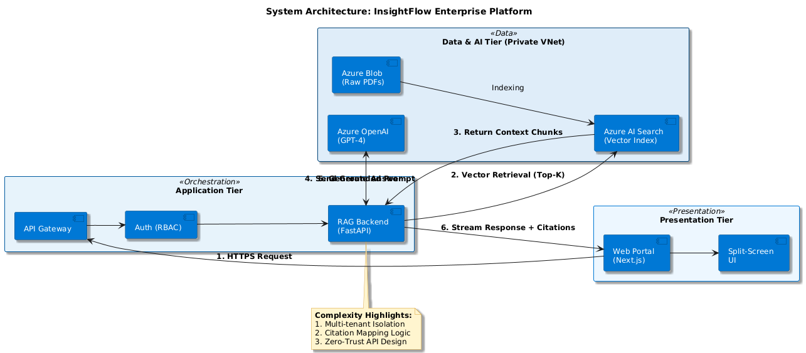

# InsightFlow: Enterprise-Grade Verifiable RAG Architecture

[]()
[]()
[]()

## 1. Project Overview
InsightFlow is a "Private Brain" Retrieval-Augmented Generation (RAG) system engineered for high-stakes **FinTech** and **GovTech** sectors. Unlike generic chatbots, InsightFlow is built on the **"Glass Box"** principle: every AI-generated claim must be mathematically traceable and visually verifiable against original source documents.

## 2. Core Architectural Principles
* **Zero-Trust Verifiability:** Every response is strictly anchored to PDF coordinates.
* **Modular Engine Decoupling:** The system uses Python's `abc` (Abstract Base Classes) to separate the orchestration logic from specific vendor implementations, allowing for seamless transition from prototype to production.
* **Data Sovereignty:** Full deployment within Azure Virtual Networks (VNet) to ensure no data leakage to public endpoints.

## 3. System Architecture
*(System architecture diagram illustrating the split-screen verification UI and the backend orchestration layer.)*




## 4. Implementation Roadmap
We follow a progressive deployment strategy to ensure engineering excellence and security compliance:

| Phase       | Engine Type | Goal                                                                                                                                                                      | Status              |
|:------------| :--- |:--------------------------------------------------------------------------------------------------------------------------------------------------------------------------|:--------------------|
| **Phase 0** | **Dify UI Sandbox** | UX Validation & Citation Anchoring Prototype.                                                                                                                             | **Completed**       |
| **Phase 1** | **Headless API** | Decoupling Frontend from Dify orchestration using a Factory Pattern.                                                                                                      | **In Progress**     |
| **Phase 2** | **Azure Native** | Full migration to Azure AI Search & Azure OpenAI within Private VNet.                                                                                                     | **Target: Q2 2026** |
| **Phase 3** | **Multi-Cloud Ready** | Leveraging Terraform for provider-agnostic deployment. Planned integration with GCP Vertex AI as a secondary LLM provider for ultra-long context processing (1M+ tokens). | **Target: Q3 2026** |

## 5. Technical Architecture: The Modular Engine
The core of InsightFlow is the `BaseRAGEngine` abstraction. This ensures the system remains "Future-Proof."

```python
# src/engines/base.py
from abc import ABC, abstractmethod

class BaseRAGEngine(ABC):
    """
    Abstract Base Class for RAG engines.
    Ensures that every engine implementation provides verifiable citations.
    """
    @abstractmethod
    async def query_with_citation(self, query: str, document_id: str) -> dict:
        """
        Enforce a strict contract: Every answer must return 
        source text and exact PDF coordinates.
        """
        pass
```
### Transition Logic:
- DifyAdapter: Our current high-fidelity validation layer. It allows us to refine the Citation Mapper while focusing on the 10-year veteran frontend experience.

- AzureNativeEngine: Scheduled for Phase 2. This will replace the sandbox with a customized, multi-tenant vector store following my Azure Solutions Architect (AZ-305) certification.

## 6. Directory Structure
```
## 5. Directory Structure

```text
├── docs/                 # Architecture diagrams and design whitepapers
├── infra/                # Azure Bicep templates (Planned for Phase 2)
├── src/
│   ├── api/              # FastAPI endpoints and gateway logic
│   ├── core/             # Security, RBAC, and Factory patterns
│   ├── engines/          # Modular RAG adapters (Base, Dify, Azure)
│   ├── services/         # Business logic and specialized citation mapping
│   └── main.py           # Application entry point
├── tests/                # RAGAS evaluation and unit tests
├── .gitignore            # Project exclusion rules
├── README.md             # Project documentation
└── requirements.txt      # Project dependencies
```


## 7. Personal Milestone
I am currently deep-diving into the Microsoft Azure ecosystem to bridge the gap between AI research and enterprise-level infrastructure.

- Target February 2026: Azure AI Engineer Associate (AI-102)

- Target March 2026: Azure Solutions Architect Expert (AZ-305)

```
© 2026 Shengwei Liu. Architected for Trust. Engineered for Compliance.
```